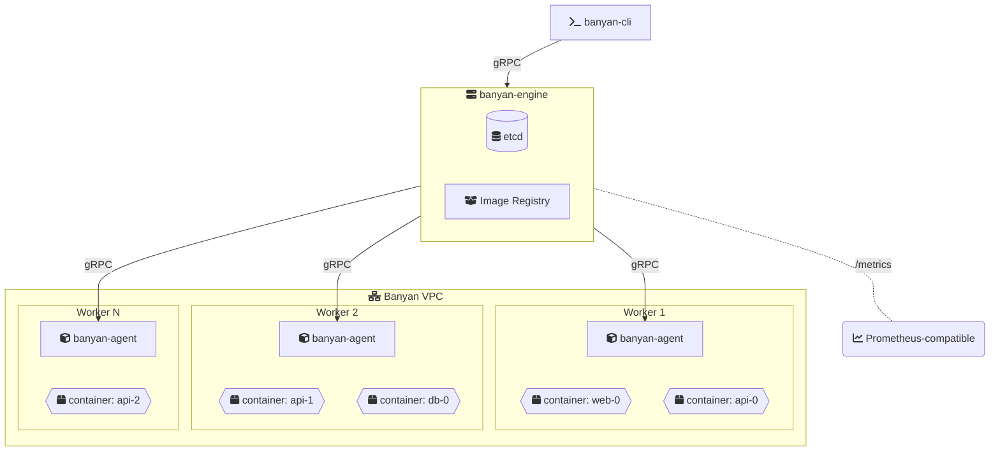

<div align="center">
  
</div>

<h1 align="center">Banyan</h1>

<p align="center"><strong>Docker Compose syntax that scales.</strong></p>

<p align="center">
  <a href="https://github.com/fertile-org/banyan/actions/workflows/ci.yml"></a>
  <a href="https://codecov.io/gh/fertile-org/banyan"></a>
  <a href="https://github.com/fertile-org/banyan/releases/latest"></a>
  
</p>

<p align="center">Deploy containers across multiple servers with a YAML file you already know how to write.</p>

<p align="center">
  <a href="https://getbanyan.dev/">Documentation</a> &middot;
  <a href="https://getbanyan.dev/getting-started/quickstart/">Quickstart</a> &middot;
  <a href="https://getbanyan.dev/roadmap/">Roadmap</a> &middot;
  <a href="./DEVELOPMENT.md">Development</a>
</p>

---

> **Under experiment.** Banyan is not yet production-ready. We encourage you to experiment, break things, and [share feedback](https://github.com/fertile-org/banyan/issues).

## From one server to many

You know Docker Compose. You write a `docker-compose.yml`, run `docker compose up`, and it works — on one machine.

Then you need more. More servers, more replicas, more availability. The usual next step involves weeks of learning, dozens of new concepts, and infrastructure that's heavier than your application.

**Banyan takes a different approach.** Same YAML syntax you already write, distributed across your servers. No new language to learn. No templating. No 50-page getting started guide.

## Two lines of diff

**docker-compose.yml** — everything on one machine:

```yaml
services:
  web:
    build: ./web
    ports:
      - "80:80"

  api:
    build: ./api
    ports:
      - "8080:8080"
    environment:
      - DB_HOST=db

  db:
    image: postgres:15-alpine
```

**banyan.yaml** — distributed across your cluster:

```yaml
name: my-app                  # ← add a name

services:
  web:
    build: ./web
    ports:
      - "80:80"

  api:
    build: ./api
    deploy:
      replicas: 3             # ← scale what you need
    ports:
      - "8080:8080"
    environment:
      - DB_HOST=db

  db:
    image: postgres:15-alpine
```

Same `services`. Same `build`. Same `ports`. Same `environment`. Add `name:` and optionally `deploy.replicas`, and Banyan spreads your containers across your servers.

## What you get

- **The YAML you already know** — `services`, `build`, `image`, `ports`, `environment`, `depends_on`. Same fields, same structure, same muscle memory.
- **Three binaries, nothing else** — No package managers, no plugins, no Helm charts. Download `banyan-engine`, `banyan-agent`, and `banyan-cli`. That's the entire stack.
- **Built-in image registry** — Use `build:` in your manifest and Banyan builds, stores, and distributes images across your cluster. No Docker Hub account, no Harbor, no ECR setup.
- **Containers talk across servers** — Services on different machines communicate as if they were on the same network. Banyan handles the overlay network and DNS.
- **Monitor from your terminal** — `banyan-cli status` shows every container, which server it's on, and whether it's healthy. `banyan-cli logs` streams from any container, any node. A live terminal dashboard (`banyan-cli monitor`) is coming soon.
- **Open source, self-hosted** — Apache 2.0. No vendor lock-in, no usage-based pricing. Run it on your own servers.

## Who is Banyan for?

**Teams who've outgrown a single server but don't need — or don't want — Kubernetes.**

You might be a team of 5 who needs your API on 3 servers. Or a team of 50 who wants a lighter option for staging environments and internal tools. Either way, you want to write a YAML file and deploy, not operate a platform.

Banyan handles the orchestration so you can focus on the software you're building.

## Install

```bash
# Engine node (control plane)
curl -sSL https://raw.githubusercontent.com/fertile-org/banyan/main/install.sh | sudo bash -s -- --role engine

# Worker nodes
curl -sSL https://raw.githubusercontent.com/fertile-org/banyan/main/install.sh | sudo bash -s -- --role agent
```

Or [build from source](https://getbanyan.dev/getting-started/installation/).

## Getting started

One-time setup (run once per machine):

```bash
# Control plane
sudo banyan-engine init        # Set a cluster password
sudo banyan-engine start       # Starts the engine, etcd, and image registry

# Each worker
sudo banyan-agent init         # Connect to the engine
sudo banyan-agent start        # Register and start accepting containers

# Your machine
sudo banyan-cli init           # Authenticate with the engine
```

Then deploy — every time, one command:

```bash
banyan-cli deploy -f banyan.yaml
```

After the initial setup, deploying is always one command. See the [Quickstart](https://getbanyan.dev/getting-started/quickstart/) for a complete walkthrough.

## Architecture



The **CLI** sends your manifest to the **Engine**, which stores state in etcd and schedules containers across **Agents**. Each Agent runs containerd and pulls images from the Engine's built-in registry. All communication is authenticated over gRPC.

## Documentation

Full documentation at **[getbanyan.dev](https://getbanyan.dev/)**.

- [Installation](https://getbanyan.dev/getting-started/installation/)
- [Quickstart](https://getbanyan.dev/getting-started/quickstart/)
- [Manifest Reference](https://getbanyan.dev/reference/manifest/)
- [Multi-Node Setup](https://getbanyan.dev/guides/multi-node/)
- [CLI Reference](https://getbanyan.dev/reference/cli/)
- [Troubleshooting](https://getbanyan.dev/reference/troubleshooting/)

## Roadmap

See the [Roadmap](https://getbanyan.dev/roadmap/) — Prometheus metrics, terminal UI monitoring, resource-aware scheduling, auto-scaling, and more.

## Contributing

See the [Development Guide](./DEVELOPMENT.md) for project structure, build commands, and architecture.

## License

Apache License 2.0. See [LICENSE](./LICENSE) for details.

---


