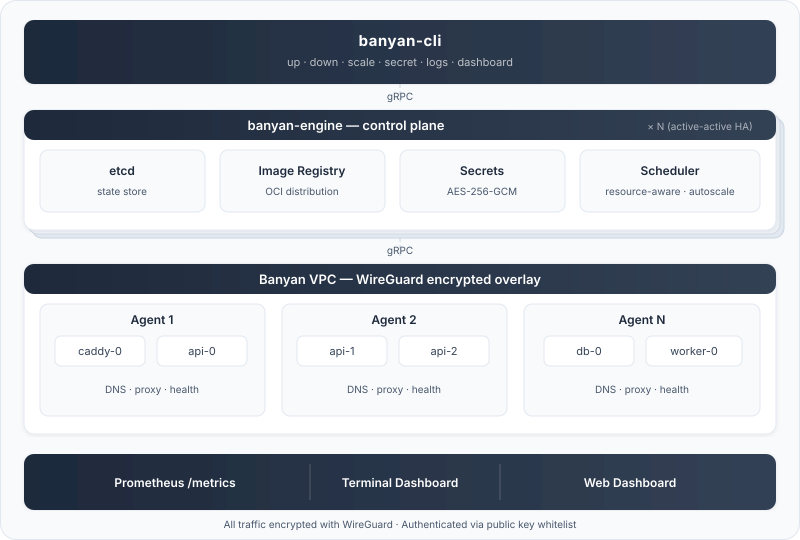

<div align="center">
  
</div>

<h1 align="center">Banyan</h1>

<p align="center"><strong>Container orchestration you already know.</strong></p>

<p align="center">
  <a href="https://github.com/fertile-org/banyan/actions/workflows/ci.yml"></a>
  <a href="https://codecov.io/gh/fertile-org/banyan"></a>
  <a href="https://github.com/fertile-org/banyan/releases/latest"></a>
  
</p>

<p align="center">Run containers across multiple servers with the Docker Compose syntax you already know.</p>

<p align="center">
  <a href="https://getbanyan.dev/">Documentation</a> &middot;
  <a href="https://getbanyan.dev/getting-started/quickstart/">Quickstart</a> &middot;
  <a href="https://getbanyan.dev/roadmap/">Roadmap</a> &middot;
  <a href="./DEVELOPMENT.md">Development</a>
</p>

<table align="center">
  <tr>
    <td align="center" valign="top" bgcolor="white">
      <sub><strong>SECURED BY</strong></sub><br><br>
      
    </td>
    <td align="center" valign="top" bgcolor="white">
      <sub><strong>BUILT WITH</strong></sub><br><br>
      
      &nbsp;&nbsp;
      
      <br><br>
      
      &nbsp;&nbsp;
      
    </td>
  </tr>
</table>

> **Under experiment.** Banyan is not yet production-ready. We encourage you to experiment, break things, and [share feedback](https://github.com/fertile-org/banyan/issues).


<div align="center">
  <video src="https://github.com/user-attachments/assets/26d4e454-48b8-402f-b837-5cc00a251738" autoplay loop muted playsinline></video>
  <sub><code>banyan-cli dashboard</code> — monitor your entire cluster from the terminal</sub>
</div>

## From one server to many

You know Docker Compose. You write a `docker-compose.yml`, run `docker compose up`, and it works — on one machine.

Then you need more. More servers, more replicas, more availability. The usual next step involves weeks of learning, dozens of new concepts, and infrastructure that's heavier than your application.

**Banyan takes a different approach.** Same YAML syntax you already write, distributed across your servers. No new language to learn. No templating. No 50-page getting started guide.

## One manifest, production-ready

```yaml
name: my-app

services:
  caddy:
    image: caddy:latest
    command: caddy reverse-proxy --from example.com --to api:8080
    deploy:
      placement:
        node: gateway-*       # ← pin to your public-facing servers
    ports:
      - "80:80"
      - "443:443"

  api:
    build: ./api
    deploy:
      replicas: 3             # ← scale what you need
      autoscale:
        min: 2
        max: 10
        target_cpu: 70        # ← or let Banyan scale for you
    ports:
      - "8080:8080"
    environment:
      - DB_HOST=db
    secrets:
      - DB_PASSWORD           # ← encrypted, not in your YAML

  db:
    image: postgres:15-alpine
    volumes:
      - db-data:/var/lib/postgresql/data
    deploy:
      placement:
        node: db-*

volumes:
  db-data:
```

Same `services`, `build`, `ports`, `environment` you already know from Docker Compose. Add `deploy.replicas` to scale, `deploy.autoscale` for automatic scaling, `secrets` for encrypted credentials, and `volumes` for persistent storage. One command to deploy: `banyan-cli up -f banyan.yaml`.

## What you get

- **The YAML you already know** — `services`, `build`, `image`, `ports`, `environment`, `depends_on`, `volumes`. Same fields, same structure, same muscle memory.
- **Three binaries, nothing else** — No package managers, no plugins, no Helm charts. Download `banyan-engine`, `banyan-agent`, and `banyan-cli`. That's the entire stack.
- **Built-in image registry** — Use `build:` in your manifest and Banyan builds, stores, and distributes images across your cluster. No Docker Hub account, no Harbor, no ECR setup.
- **Containers talk across servers** — Services on different machines communicate as if they were on the same network. All traffic encrypted with WireGuard. Banyan sets up the overlay network and DNS automatically.
- **Auto-scaling built in** — Define `target_cpu` in your manifest and Banyan scales replicas automatically. Or scale manually with `banyan-cli scale my-app api=5`.
- **Encrypted secrets** — `banyan-cli secret create DB_PASSWORD` — encrypted at rest, injected into containers as env vars. No plaintext in manifests, no external Vault.
- **High availability** — Run multiple engines for zero-downtime control plane. All engines are active — no leader election, no manual failover.
- **Live terminal dashboard** — `banyan-cli dashboard` opens a real-time TUI showing engine health, agents, deployments, container status, and cluster events. No Grafana setup, no browser — monitoring is one command away.
- **Open source, self-hosted** — Apache 2.0. No vendor lock-in, no usage-based pricing. Run it on your own servers.

## Who is Banyan for?

**Teams who've outgrown a single server but don't need — or don't want — Kubernetes.**

You might be a team of 5 who needs your API on 3 servers. Or a team of 50 who wants a lighter option for staging environments and internal tools. Either way, you want to write a YAML file and ship, not operate a platform.

Banyan handles the orchestration so you can focus on the software you're building.

## Platform support

| Platform | Architecture | Status |
|----------|-------------|--------|
|  **Linux** (Ubuntu, Debian, Pop!_OS, Mint, RHEL, Fedora, Rocky) | x86_64, ARM64 | ✅ Supported |
|  **macOS** | | 🔜 Coming soon |
|  **Windows** | | ❌ Not planned |

## Install

```bash
# Engine node (control plane)
curl -sSL https://raw.githubusercontent.com/fertile-org/banyan/main/install.sh | sudo bash -s -- --role engine

# Agent nodes
curl -sSL https://raw.githubusercontent.com/fertile-org/banyan/main/install.sh | sudo bash -s -- --role agent
```

Or [build from source](https://getbanyan.dev/getting-started/installation/).

## Getting started

One-time setup on each machine:

```bash
# Control plane
sudo banyan-engine init
sudo systemctl enable --now banyan-engine

# Each agent
sudo banyan-agent init
sudo systemctl enable --now banyan-agent

# Your deploy machine (no sudo after init)
sudo banyan-cli init
```

Then deploy — every time, one command:

```bash
banyan-cli up -f banyan.yaml
```

See the [Quickstart](https://getbanyan.dev/getting-started/quickstart/) for a complete walkthrough.

## Architecture

<div align="center">
  
</div>

The **CLI** sends your manifest to the **Engine**, which stores state in etcd, manages encrypted secrets, and schedules containers across **Agents** (with auto-scaling). Each Agent runs containerd and pulls images from the built-in registry. All communication is encrypted with WireGuard. For high availability, run [multiple engines](https://getbanyan.dev/guides/high-availability/) — they coordinate automatically.

## Documentation

Full documentation at **[getbanyan.dev](https://getbanyan.dev/)**.

- [Installation](https://getbanyan.dev/getting-started/installation/)
- [Quickstart](https://getbanyan.dev/getting-started/quickstart/)
- [Manifest Reference](https://getbanyan.dev/reference/manifest/)
- [CLI Reference](https://getbanyan.dev/reference/cli/)
- [Multi-Agent Setup](https://getbanyan.dev/guides/multi-node/)
- [High Availability](https://getbanyan.dev/guides/high-availability/)
- [Auto-Scaling](https://getbanyan.dev/guides/auto-scaling/)
- [Secrets](https://getbanyan.dev/guides/secrets/)
- [Monitoring](https://getbanyan.dev/guides/monitoring/)
- [Troubleshooting](https://getbanyan.dev/reference/troubleshooting/)

## Roadmap

See the [Roadmap](https://getbanyan.dev/roadmap/) for what's shipped and what's next.

## Contributing

See the [Development Guide](./DEVELOPMENT.md) for project structure, build commands, and architecture.

## License

Apache License 2.0. See [LICENSE](./LICENSE) for details.
