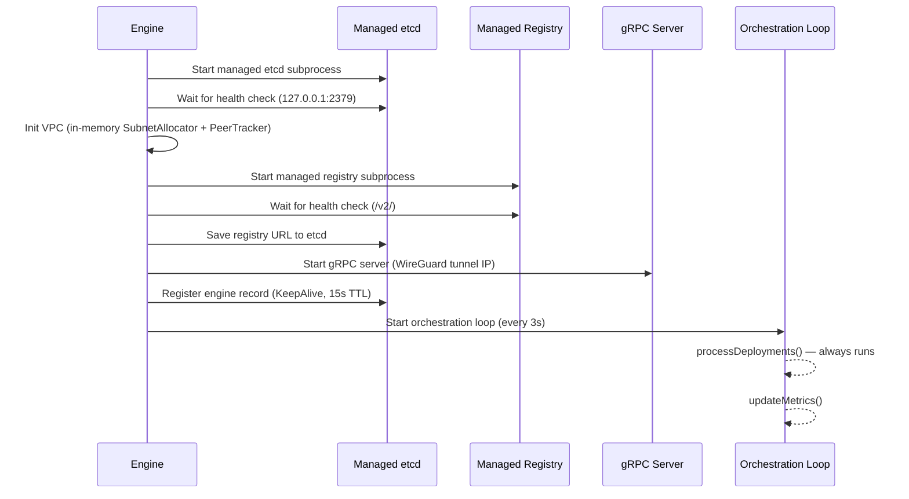
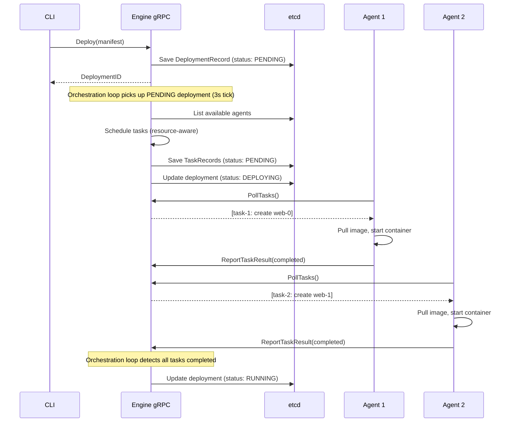
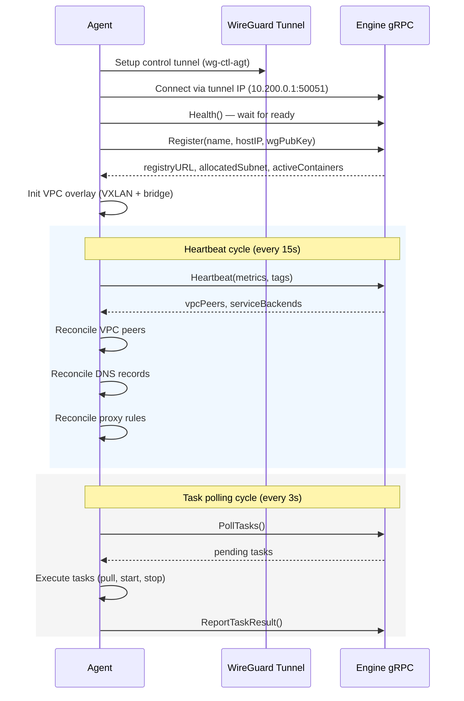
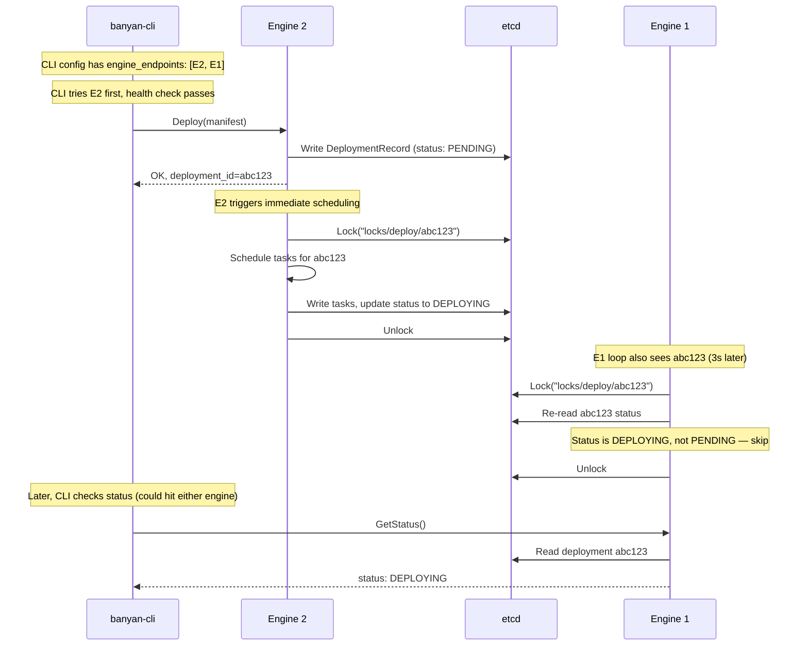
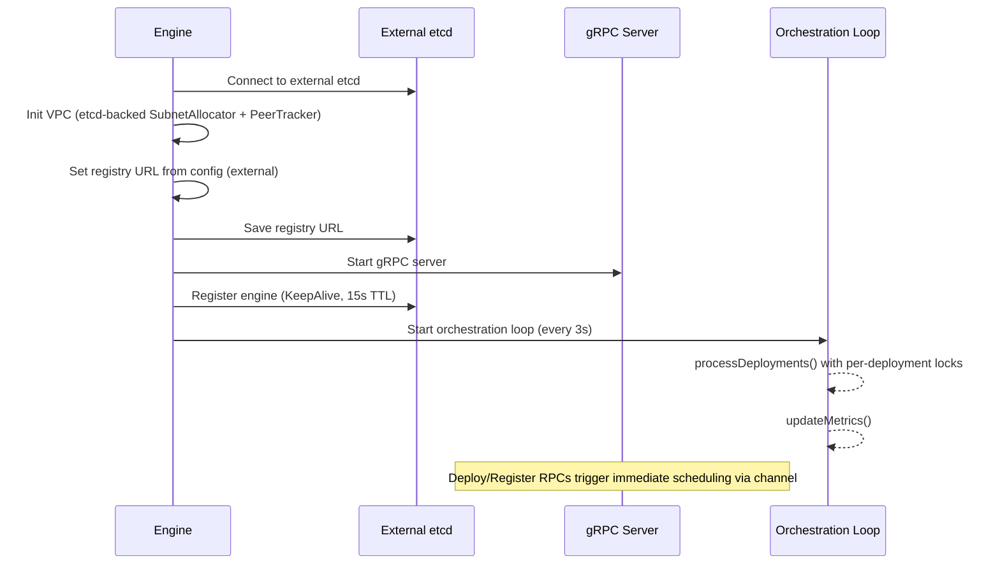
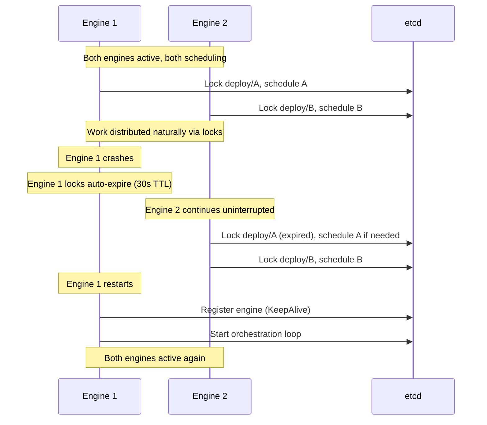
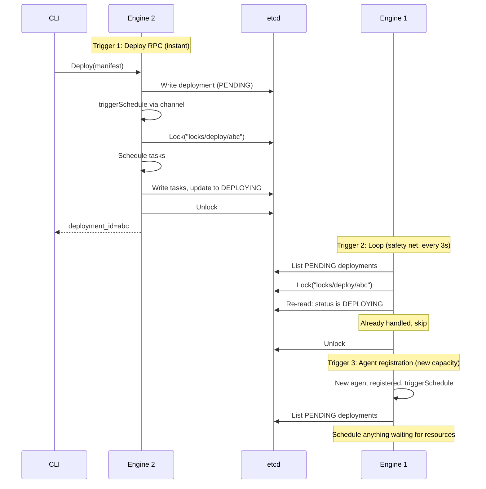
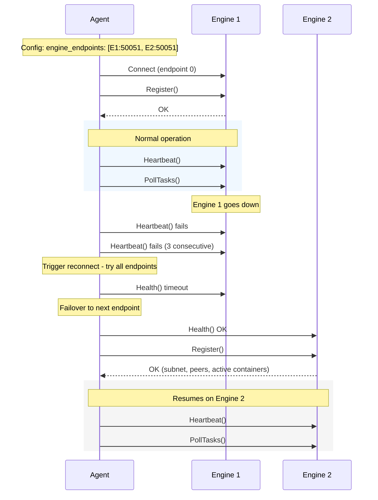
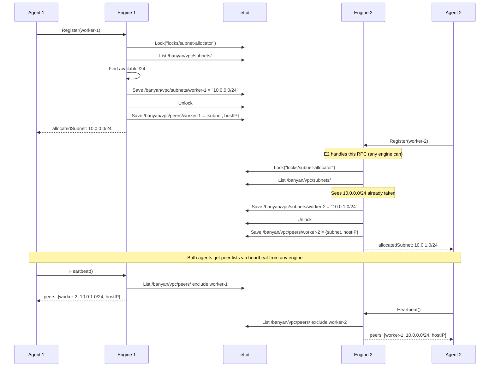

# Engine Modes — Technical Flow Diagrams

## Overview

Banyan supports two deployment modes:

- **Single-engine** — one engine process manages everything (default)
- **Multi-engine HA** — 2+ engines share state via external etcd, with leader-based scheduling

Both modes use the same agent and CLI binaries. The difference is in how engines coordinate.

---

## 1. Single-Engine Mode

### Startup Flow



### Request Flow (Deploy)



### Agent Connection Flow



---

## 2. Multi-Engine HA Mode

### Architecture

All engines are **identical processes**. Every engine handles RPCs AND runs the scheduling loop. Per-deployment distributed locks in etcd prevent duplicate work. There is no leader — all engines are active.

If an engine dies, the others continue immediately. No election, no failover delay.

```mermaid
graph LR
    subgraph Clients
        CLI[banyan-cli]
        A1[Agent 1]
        A2[Agent 2]
    end

    subgraph Engines — all identical, all active
        E1["Engine 1<br/>gRPC + Scheduling"]
        E2["Engine 2<br/>gRPC + Scheduling"]
    end

    subgraph Shared State
        Etcd[(etcd cluster)]
        Reg[OCI Registry]
    end

    CLI -->|"connects to any"| E1
    CLI -.->|"failover"| E2
    A1 -->|"connects to any"| E1
    A1 -.->|"failover"| E2
    A2 -->|"connects to any"| E2
    A2 -.->|"failover"| E1

    E1 <-->|"per-deployment locks"| Etcd
    E2 <-->|"per-deployment locks"| Etcd
    E1 --> Reg
    E2 --> Reg
```

### How requests reach engines

Clients connect to any engine. The engine that receives the Deploy RPC writes to etcd AND schedules immediately. No leader, no forwarding, no delay.



### Startup Flow (per engine)

Every engine starts the same way. No leader election — all engines are active.



### Engine Failover (Active-Active)

No leader election means no failover delay. When an engine dies, the others continue immediately.



### Scheduling Triggers

Scheduling happens via three triggers. Per-deployment locks ensure no duplicate work.



### Agent Multi-Endpoint Failover



### VPC State Coordination (etcd-backed)



---

## 3. Mode Comparison

| Aspect | Single-Engine | Multi-Engine HA |
|--------|--------------|-----------------|
| **etcd** | Managed subprocess | External cluster (user-provided) |
| **Registry** | Managed subprocess | External registry (user-provided) |
| **Scheduling** | Direct (no locking) | Active-active + per-deployment distributed locks |
| **VPC state** | In-memory maps | etcd-backed (CAS + locks) |
| **Agent connection** | Single endpoint | Multiple endpoints with failover |
| **Failover time** | N/A (single point) | **Instant** (no leader election, lock TTL only) |
| **Config complexity** | Zero (all defaults) | Requires external etcd + registry URLs |

### etcd Key Schema

```
/banyan/
├── deployments/{id}          # DeploymentRecord (shared)
├── nodes/{name}              # NodeRecord (shared)
├── tasks/{agent}/{id}        # TaskRecord (shared)
├── registry                  # Registry URL (shared)
├── engines/{id}              # EngineRecord (15s TTL lease)
└── vpc/
    ├── subnets/{agent}       # Allocated /24 subnet (multi-engine only)
    └── peers/{agent}         # Peer overlay info (multi-engine only)
```
