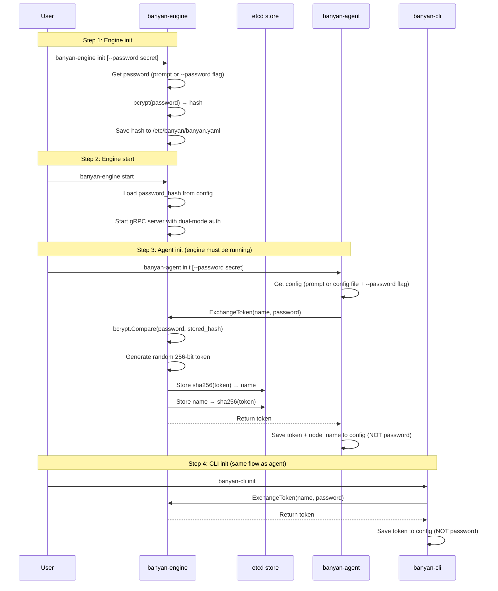
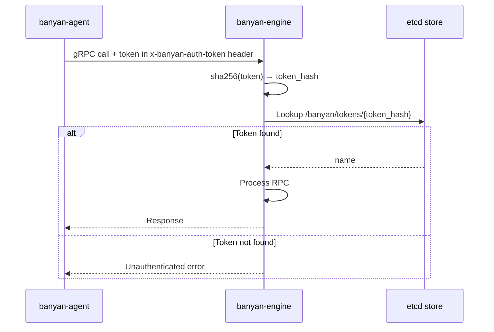
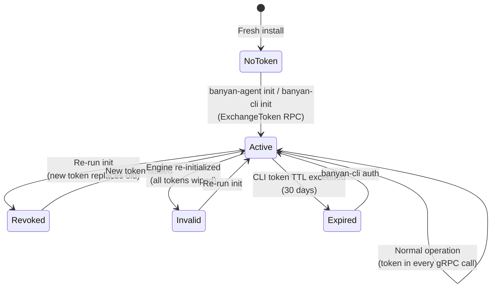
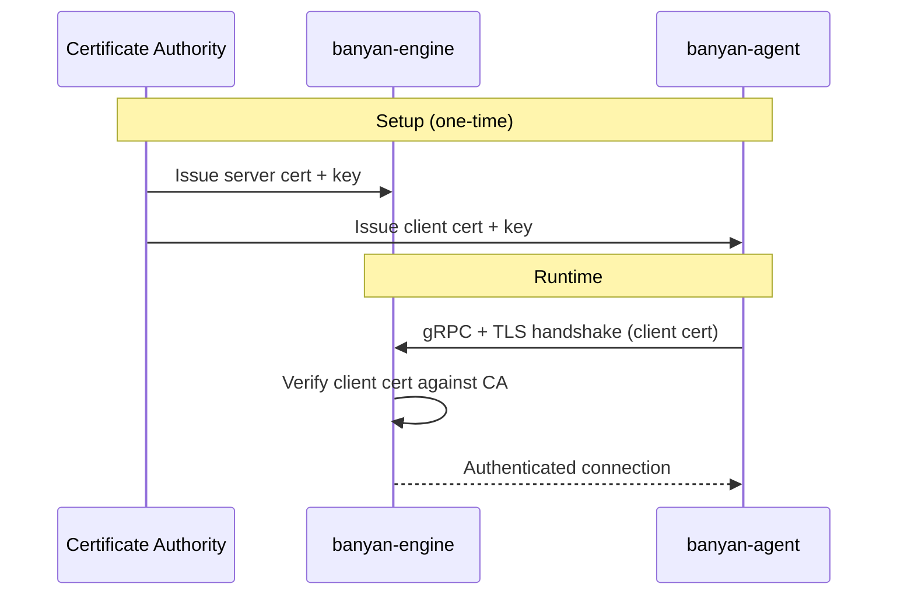
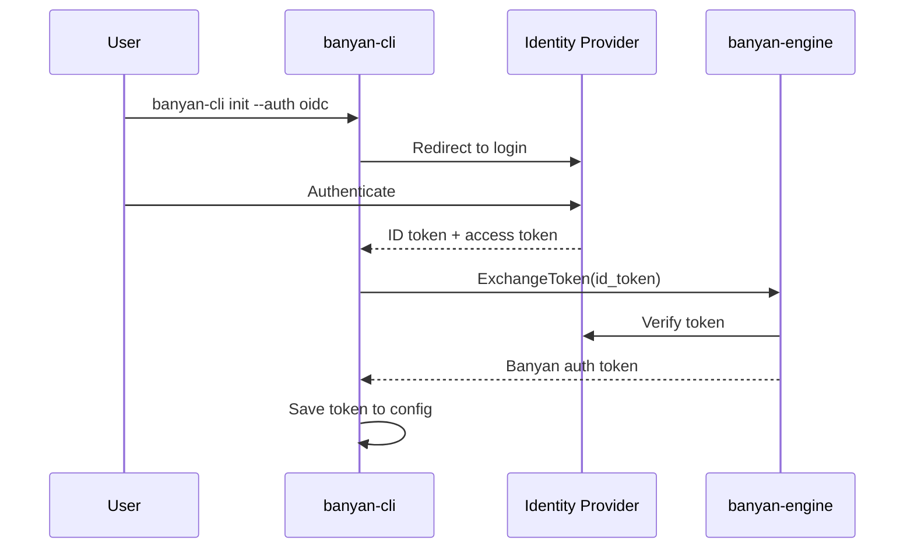

Banyan authenticates all gRPC communication between components. Every RPC call carries credentials that the engine validates before processing the request.

## Auth methods

| Method | Status | How it works |
|--------|--------|--------------|
| **Password + Token Exchange** | Available | Password used once at init to obtain a long-lived auth token |
| **mTLS** | Planned | Mutual TLS with client certificates |
| **OIDC / SSO** | Planned | Delegate authentication to an identity provider |

---

## Password + Token Exchange

This is Banyan's default authentication method. The cluster password is used **once** during initialization to obtain an auth token. The token is used for all subsequent communication. The plain-text password is never stored on disk.

### How it works

There are two distinct phases: **init time** (one-time setup) and **runtime** (ongoing operation).

#### Init-time flow

During `init`, each component exchanges the cluster password for an auth token. The password can be provided interactively (default) or via the `--password` flag for automation:



#### Runtime flow

After init, all communication uses the auth token:



### Config files

After initialization, each component stores only what it needs:

**Engine** (`/etc/banyan/banyan.yaml`):
```yaml
engine:
  password_hash: "$2a$10$..."   # bcrypt hash — never the plain password
  grpc_port: "50051"
  store_backend: "etcd"
```

**Agent** (`/etc/banyan/banyan.yaml`):
```yaml
agent:
  engine_host: "192.168.1.10"
  engine_port: "50051"
  auth_token: "a1b2c3d4e5f6..."  # random token from ExchangeToken
  node_name: "worker-1"
```

**CLI** (`/etc/banyan/banyan.yaml`):
```yaml
cli:
  engine_host: "192.168.1.10"
  engine_port: "50051"
  auth_token: "e5f6g7h8i9j0..."  # random token from ExchangeToken
```

### Token lifecycle

Tokens are managed through the `ExchangeToken` RPC:



- **Issue**: Running `init` on an agent or CLI calls `ExchangeToken`, which generates a new random token and stores it in etcd with a dual index (`sha256(token) → record` and `name → sha256(token)`).
- **Re-issue**: Running `init` again for the same name revokes the old token (deletes it from etcd) and issues a new one. The old token stops working immediately.
- **CLI token TTL**: CLI tokens expire after **30 days**. When a CLI token expires, run `banyan-cli auth` to re-authenticate. Agent tokens do not expire because agents run on controlled infrastructure.
- **Revoke all**: Re-initializing the engine (or wiping etcd) invalidates all tokens. All agents and CLI clients must re-authenticate.

### Re-authentication

If a token is revoked or the engine is re-initialized, you don't need to re-run the full `init` wizard. The `auth` command reads the existing config (engine host, port, node name) and only prompts for the cluster password:

```bash
# Agent
sudo banyan-agent auth

# CLI
sudo banyan-cli auth
```

This is faster than `init` because it skips directory creation, dependency checks, and connection prompts. The `auth` command requires an existing config from a previous `init` run — if no config exists, it tells you to run `init` first.

### Non-interactive init

All `init` commands accept a `--password` flag to skip the interactive password prompt. This is useful for automation, CI/CD pipelines, and containerized deployments:

```bash
# Engine: hash the password and save it
sudo banyan-engine init --password "my-cluster-secret"

# Agent: exchange the password for a token (requires engine connection in config)
sudo banyan-agent init --password "my-cluster-secret"
```

For the agent, write a config file with `agent.engine_host` and `agent.engine_port` before running `init --password`. The agent uses these to connect to the engine and exchange the password for a token. The password is never written to disk.

### Security properties

| Property | How |
|----------|-----|
| Password never stored in plain text | Engine stores bcrypt hash; agents/CLI never store the password |
| Tokens are random and unique | 256-bit cryptographically random, hex-encoded |
| Token hashing in etcd | Tokens stored as SHA-256 hashes — etcd compromise doesn't leak usable tokens |
| Per-name revocation | Re-running init for a name revokes only that name's token |
| No replay across names | Each token is bound to a specific name via the dual index |
| CLI token TTL | CLI tokens expire after 30 days, limiting blast radius of compromised workstations |

---

## mTLS (planned)

Mutual TLS authentication will allow components to authenticate using X.509 client certificates instead of password-derived tokens.



This method will be suitable for environments with existing PKI infrastructure or stricter security requirements. Configuration details will be documented when this feature is implemented.

---

## OIDC / SSO (planned)

OpenID Connect integration will allow Banyan to delegate authentication to an external identity provider (e.g., Google, Okta, Keycloak).



This method will be suitable for teams that want centralized identity management. Configuration details will be documented when this feature is implemented.
