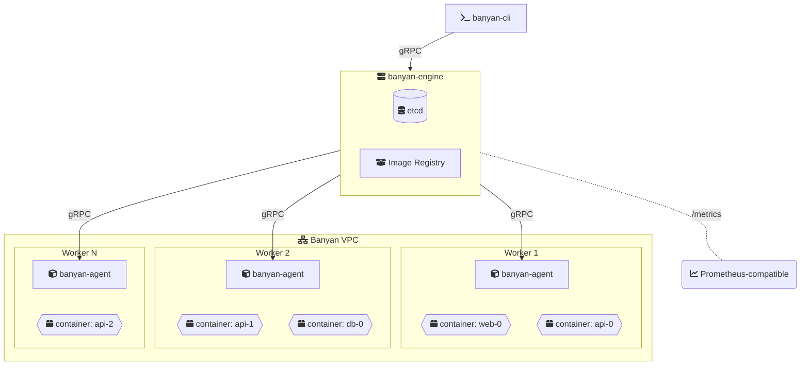

import { Card, CardGrid, Aside } from "@astrojs/starlight/components";

<Aside type="caution" title="Under experiment">
  Banyan is not yet production-ready. We encourage you to experiment, break things, and [share feedback](https://github.com/fertile-org/banyan/issues).
</Aside>

## From one server to many

You know Docker Compose. You write a `docker-compose.yml`, run `docker compose up`, and everything works on one machine.

Then your app grows. You want your services spread across separate servers, or running multiple replicas to handle load. Either way, you need more than one machine.

**Banyan makes that step simple.** Use the same YAML syntax you already know, and Banyan distributes your services across your servers.

## Same syntax, more servers

**docker-compose.yml** — everything on one machine:

```yaml
services:
  web:
    build: ./web
    ports:
      - "80:80"

  api:
    build: ./api
    ports:
      - "8080:8080"
    environment:
      - DB_HOST=db

  db:
    image: postgres:15-alpine
```

**banyan.yaml** — distributed across your cluster:

```yaml
name: my-app

services:
  web:
    build: ./web
    ports:
      - "80:80"

  api:
    build: ./api
    deploy:
      replicas: 3
    ports:
      - "8080:8080"
    environment:
      - DB_HOST=db

  db:
    image: postgres:15-alpine
```

Same `services`. Same `build`. Same `ports`. Same `environment`. Add `name:` and `deploy.replicas`, and Banyan spreads them across your servers automatically.


<CardGrid>
  <Card title="Familiar syntax" icon="document">
    If you can write a docker-compose.yml, you can write a banyan.yaml. Same fields, same structure.
  </Card>
  <Card title="Single-binary components" icon="setting">
    Three small, focused binaries. Download, run, done. No complex setup or configuration management required.
  </Card>
  <Card title="Built-in image registry" icon="star">
    No Docker Hub, no private registry setup. Use `build:` in your manifest and Banyan builds, stores, and distributes your images automatically. Deploy to a cluster as easily as running locally.
  </Card>
  <Card title="Automatic distribution" icon="rocket">
    Services are automatically distributed across your servers. Add a node, it picks up work on the next deployment.
  </Card>
  <Card title="Built-in VPC" icon="shield">
    Secure cross-node networking using Flannel with VXLAN overlay and built-in DNS service discovery. Services on different servers communicate as if they were on the same network.
  </Card>
  <Card title="Proven foundations" icon="approve-check">
    Built on battle-tested technologies: etcd, containerd, gRPC, and Prometheus metrics (coming soon).
  </Card>
</CardGrid>

## Is Banyan right for you?

**Banyan is built for teams who:**

- **Know Docker Compose** and want the same simplicity across multiple servers
- **Need to scale beyond one machine** without learning Kubernetes
- **Value shipping software** over operating infrastructure

Banyan bridges the gap between "docker compose up" and production orchestration — same syntax, distributed execution.

## Three commands to a running cluster

```bash
# On your control plane server
sudo banyan-engine start

# On each worker server
sudo banyan-agent start --node-name agent-1

# From anywhere
banyan-cli deploy -f banyan.yaml
```

No package managers. No plugins. Three focused binaries — engine, agent, and CLI.

## Architecture



**CLI** sends commands to the **Engine** (control plane), which stores state in **etcd** and schedules work across **Agents** (workers). All communication over gRPC with password auth. Metrics are exposed in Prometheus format for monitoring.
