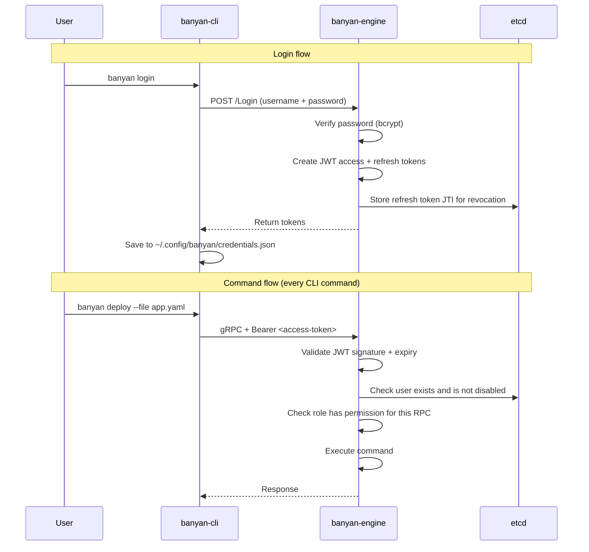

This page covers the internal workings of Banyan's authentication systems. For user-facing commands and setup, see [Guides/Auth](/guides/authentication/).

---

## User Authentication (JWT)

### Security properties

| Property | How |
|----------|-----|
| Passwords hashed with bcrypt (cost 12) | Never stored or transmitted in plaintext |
| Token rotation on refresh | Old refresh token is revoked when a new one is issued |
| Instant role changes | Role is checked against the user store on every request, not cached in the token |
| Account disable | Admins can disable a user — takes effect immediately |
| Last-admin protection | Cannot delete or demote the last active admin |
| Login rate limiting | 10 attempts per minute per IP to prevent brute force |

### How it works

### Password storage

Passwords are stored as bcrypt hashes in etcd. The hash is never exposed — `banyan user list` omits password fields entirely.

### Token lifecycle

1. **Login** → engine creates access token (1h) + refresh token (7d)
2. **Every command** → CLI attaches access token as `Authorization: Bearer <token>`
3. **Token expires** → CLI detects `Unauthenticated` error, calls `RefreshToken` with refresh token
4. **Refresh** → engine validates refresh token, issues new token pair, revokes old refresh token
5. **Logout** → CLI revokes refresh token on engine, deletes local credentials file
