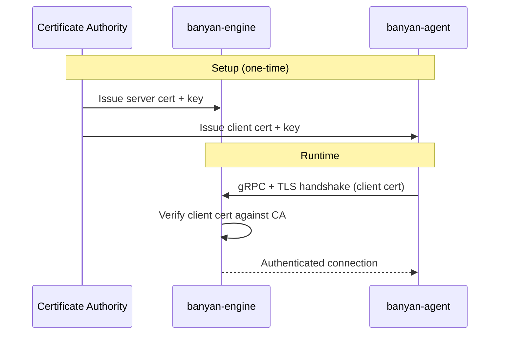
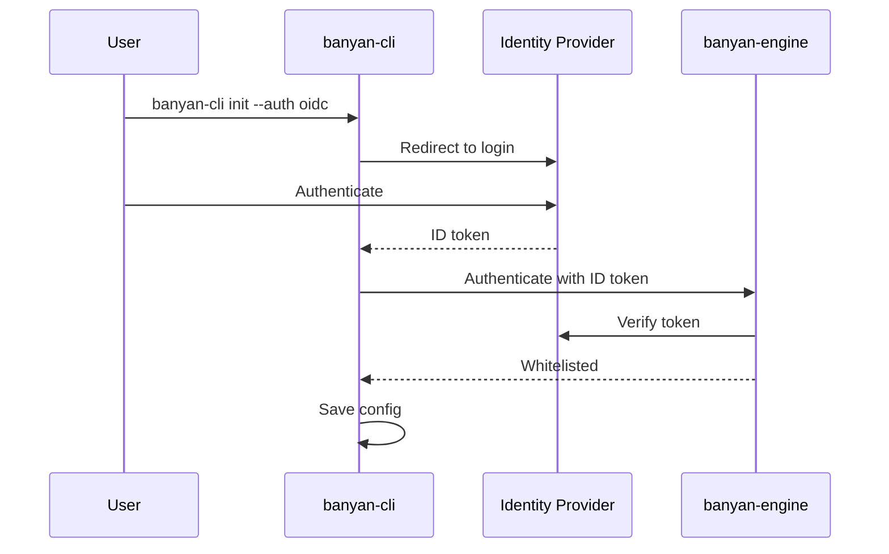

Banyan has two layers of authentication:

| Layer | Purpose | Method |
|-------|---------|--------|
| **User Auth** | User access via CLI | JWT tokens (username + password) |
| **VPC** | Engine ↔ Agent ↔ CLI | WireGuard |

---

## User Authentication (JWT)

Banyan supports multi-user access with role-based permissions. Users authenticate with a username and password, receiving JWT tokens that authorize their CLI commands.

### Quick start

```bash
# Login as admin (created during engine init)
banyan login
# Username: admin
# Password: <your-admin-password>

# Check your identity
banyan whoami
# Username: admin
# Role:     admin
```

### Roles

Banyan has three built-in roles. Each role grants a specific set of permissions:

| Role | Permissions |
|------|-------------|
| **admin** | Full access — manage users, deploy, scale, secrets, everything |
| **deployer** | Deploy and manage deployments, read logs/status, read secrets, change own password |
| **viewer** | Read-only — view deployments, containers, logs, status, change own password |

### Login and session

When you log in, Banyan issues two tokens:

| Token | Lifetime | Purpose |
|-------|----------|---------|
| **Access token** | 1 hour | Attached to every CLI command for authorization |
| **Refresh token** | 7 days | Used to get a new access token when it expires |

Tokens are stored locally at `~/.config/banyan/credentials.json`. The CLI automatically refreshes your access token when it expires — you don't need to re-login for a week.

```bash
# Login
banyan login

# Login non-interactively (for scripts/CI)
banyan login --username admin --password 'your-password'

# Logout (revokes refresh token on the engine)
banyan logout

# Check current identity
banyan whoami
```

### User management

User management requires **admin** role.

```bash
# List all users
banyan user list
# USERNAME  ROLE      CREATED                    CREATED BY  STATUS
# admin     admin     2026-05-25T17:24:26+07:00  init        active
# alice     deployer  2026-05-28T09:00:00+07:00  admin       active

# Create a new user (default role: viewer)
banyan user add alice --role deployer
# Password for alice: <hidden input>
# User "alice" created with role "deployer"

# Change a user's role
banyan user set-role alice viewer

# Delete a user
banyan user remove alice

# Change your own password
banyan change-password
```

See [Advanceds/Authentication](/advanceds/authentication/) for detailed security properties, how authentication works internally, and token lifecycle.

---

## VPC

Banyan uses WireGuard to create a Virtual Private Cloud (VPC) for secure communication between components (engine, agent, CLI). Each component generates a WireGuard keypair during `init`, and the engine validates public keys against a whitelist.

All control plane and container traffic is encrypted end-to-end through WireGuard tunnels.

See [Guides/VPC](/guides/vpc/) for setup, key management, and configuration details.

---

## mTLS (planned)

Mutual TLS authentication will allow components to authenticate using X.509 client certificates instead of public keys.



This will be suitable for environments with existing PKI infrastructure or stricter security requirements. See the [roadmap](/roadmap/) for status.

---

## OIDC / SSO (planned)

OpenID Connect integration will allow Banyan to delegate authentication to an external identity provider (e.g., Google, Okta, Keycloak).



This will be suitable for teams with centralized identity management. See the [roadmap](/roadmap/) for status.
