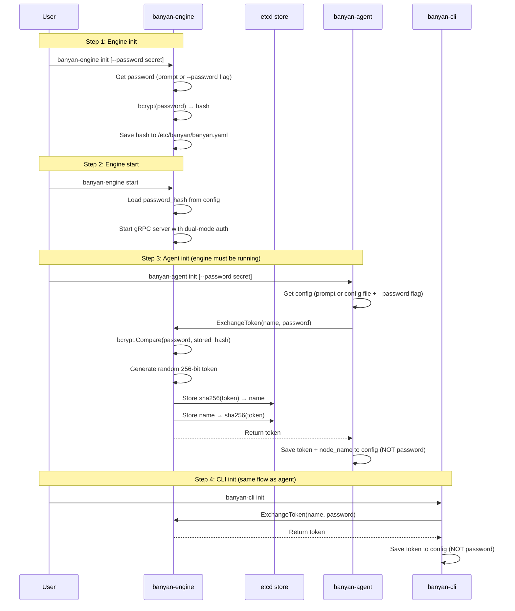
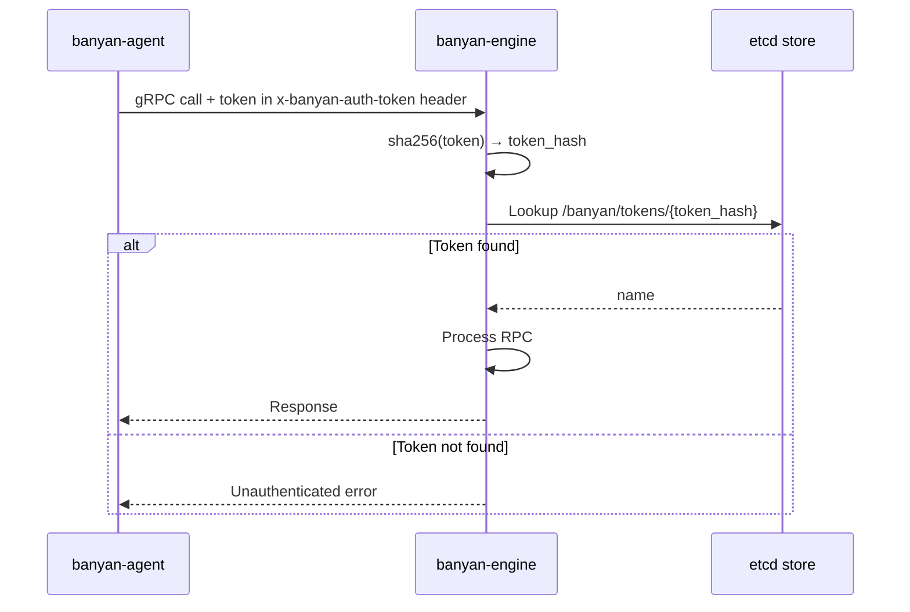
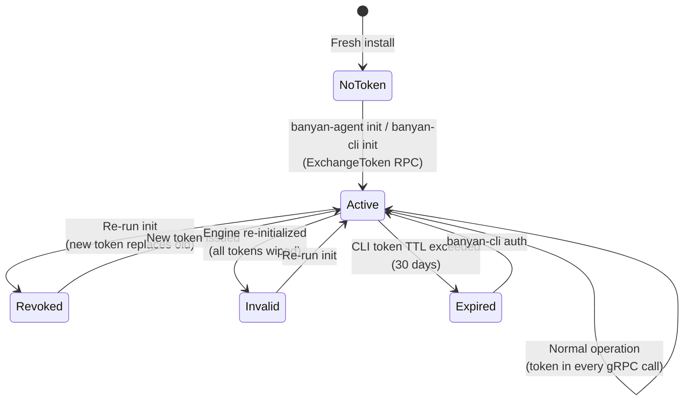
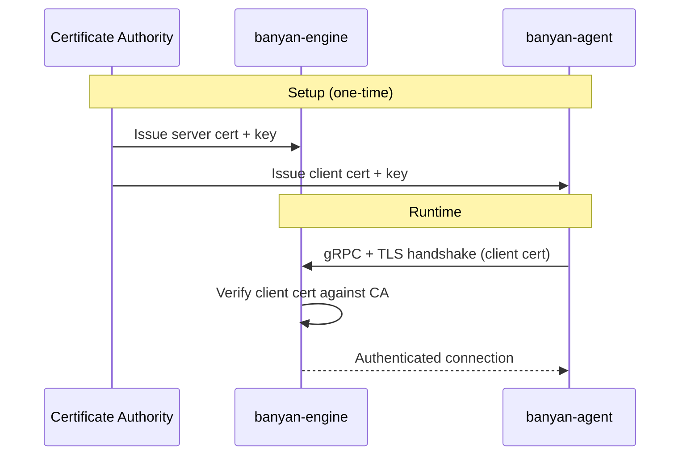
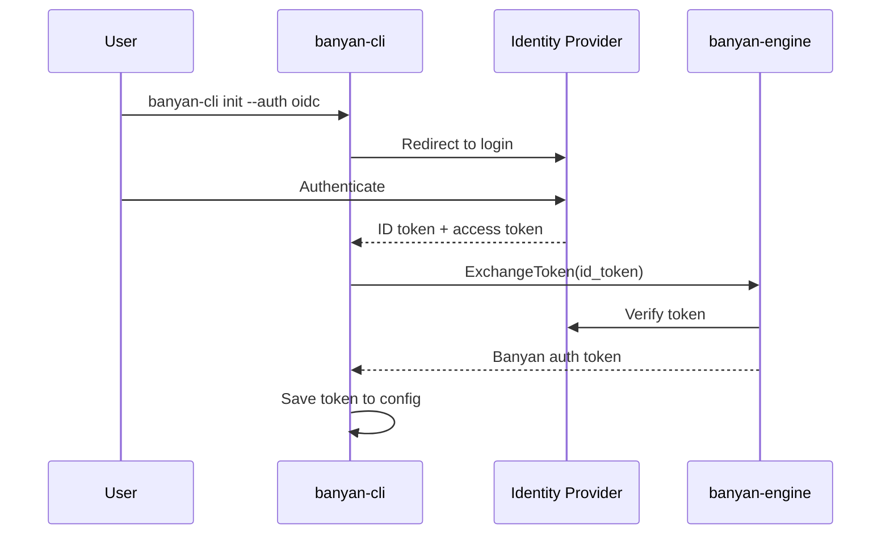

Banyan authenticates all communication between components. You set a cluster password once during setup — Banyan handles the rest. The password is exchanged for a token, and the token is used for all subsequent calls. The plain-text password is never stored on disk.

## How authentication works

| Method | Status | How it works |
|--------|--------|--------------|
| **Password + Token Exchange** | Available | Password used once at init to obtain a long-lived auth token |
| **mTLS** | Planned | Mutual TLS with client certificates |
| **OIDC / SSO** | Planned | Delegate authentication to an identity provider |

---

## Password + Token Exchange

This is Banyan's default and only current authentication method. Here's the full picture.

### Init time — one-time setup

During `init`, each component exchanges the cluster password for an auth token:



After init, each component has an auth token. The password isn't needed again until you add a new agent or CLI client.

### Runtime — ongoing operation

Every gRPC call carries the auth token. The engine validates it against the token store:



### What gets stored where

After initialization, each component stores only what it needs:

**Engine** (`/etc/banyan/banyan.yaml`):
```yaml
engine:
  password_hash: "$2a$10$..."   # bcrypt hash — never the plain password
  grpc_port: "50051"
  store_backend: "etcd"
```

**Agent** (`/etc/banyan/banyan.yaml`):
```yaml
agent:
  engine_host: "192.168.1.10"
  engine_port: "50051"
  auth_token: "a1b2c3d4e5f6..."  # random token from ExchangeToken
  node_name: "worker-1"
```

**CLI** (`/etc/banyan/banyan.yaml`):
```yaml
cli:
  engine_host: "192.168.1.10"
  engine_port: "50051"
  auth_token: "e5f6g7h8i9j0..."  # random token from ExchangeToken
```

### Token lifecycle



- **Issue**: Running `init` on an agent or CLI generates a new random token and stores it in etcd.
- **Re-issue**: Running `init` again for the same name revokes the old token and issues a new one. The old token stops working immediately.
- **CLI token TTL**: CLI tokens expire after **30 days**. Run `banyan-cli auth` to re-authenticate. Agent tokens don't expire because agents run on controlled infrastructure.
- **Revoke all**: Re-initializing the engine (or wiping etcd) invalidates all tokens. All agents and CLI clients must re-authenticate.

### Re-authentication

If a token is revoked or the engine is re-initialized, you don't need to re-run the full `init` wizard. The `auth` command reads the existing config and only prompts for the cluster password:

```bash
# Agent
sudo banyan-agent auth

# CLI
sudo banyan-cli auth
```

This is faster than `init` — it skips directory creation, dependency checks, and connection prompts. Requires an existing config from a previous `init`.

### Automation and CI/CD

All `init` commands accept `--password` to skip interactive prompts:

```bash
# Engine
sudo banyan-engine init --password "my-cluster-secret"

# Agent (write connection details first, then init exchanges for a token)
cat > /etc/banyan/banyan.yaml <<EOF
agent:
    engine_host: 192.168.1.10
    engine_port: "50051"
EOF
sudo banyan-agent init --password "my-cluster-secret"

# CLI (same pattern)
cat > /etc/banyan/banyan.yaml <<EOF
cli:
    engine_host: 192.168.1.10
    engine_port: "50051"
EOF
sudo banyan-cli init --password "my-cluster-secret"
```

The password is used once for the token exchange and never written to disk.

### Security properties

| Property | How |
|----------|-----|
| Password never stored in plain text | Engine stores bcrypt hash; agents/CLI never store the password |
| Tokens are random and unique | 256-bit cryptographically random, hex-encoded |
| Token hashing in etcd | Stored as SHA-256 hashes — etcd compromise doesn't leak usable tokens |
| Per-name revocation | Re-running init for a name revokes only that name's token |
| No replay across names | Each token is bound to a specific name via dual index |
| CLI token TTL | CLI tokens expire after 30 days, limiting exposure from compromised workstations |

---

## mTLS (planned)

Mutual TLS authentication will allow components to authenticate using X.509 client certificates instead of password-derived tokens.



This will be suitable for environments with existing PKI infrastructure or stricter security requirements. See the [roadmap](/roadmap/) for status.

---

## OIDC / SSO (planned)

OpenID Connect integration will allow Banyan to delegate authentication to an external identity provider (e.g., Google, Okta, Keycloak).



This will be suitable for teams with centralized identity management. See the [roadmap](/roadmap/) for status.
