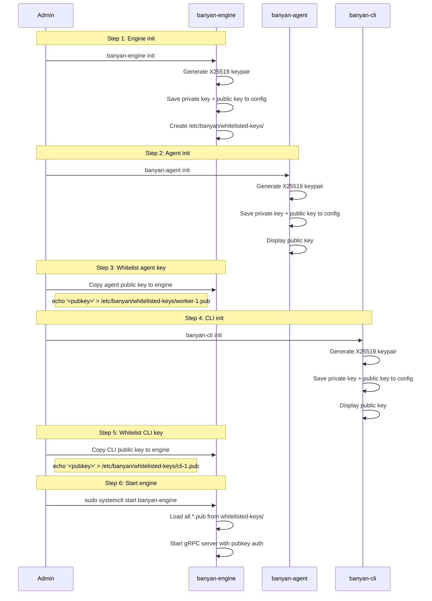
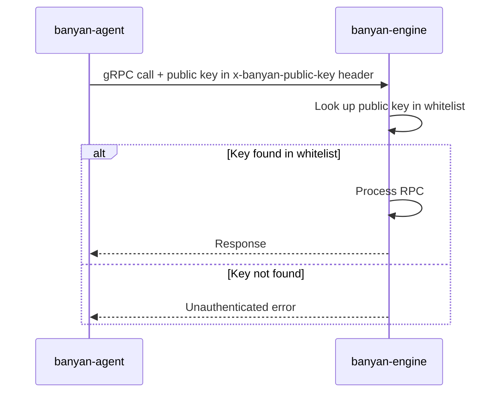
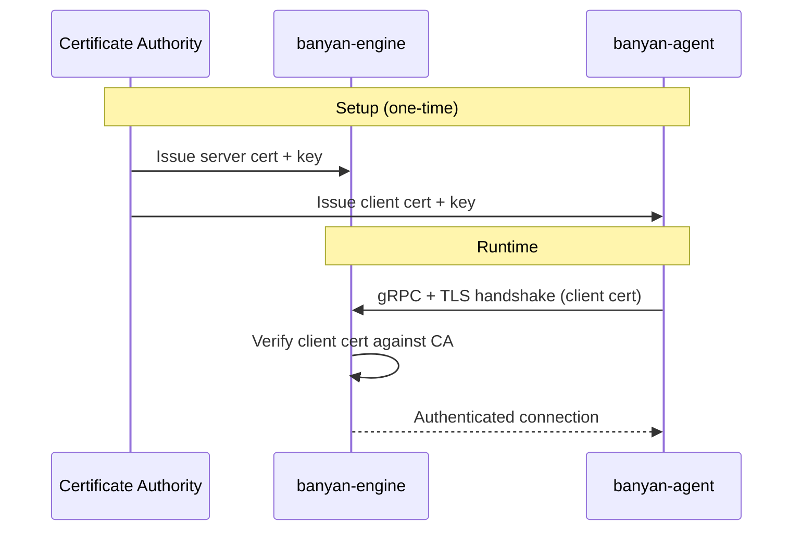
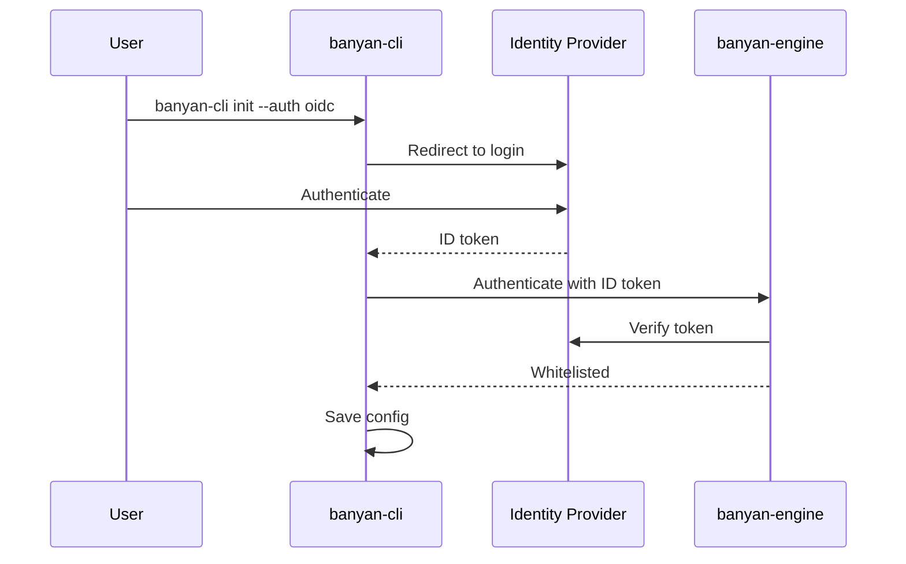

<div style="display: flex; align-items: center; gap: 1rem; margin: 1.5rem 0 2rem; padding: 1rem 1.5rem; border: 1px solid var(--sl-color-gray-5); border-radius: 12px;">
  
  <div>
    <strong style="font-size: 1.1rem;">Secured by WireGuard&reg;</strong><br />
    <span style="opacity: 0.7;">All control plane and container traffic encrypted end-to-end. No TLS certificates to manage — just keypairs.</span>
  </div>
</div>

Banyan authenticates all gRPC communication between components. Every RPC call carries credentials that the engine validates before processing the request.

## Auth methods

| Method | Status | How it works |
|--------|--------|--------------|
| **Public Key Whitelist** | Default | Each component generates a WireGuard keypair. The engine validates public keys against a whitelist directory. |
| **mTLS** | Planned | Mutual TLS with client certificates |
| **OIDC / SSO** | Planned | Delegate authentication to an identity provider |

---

## Public Key Whitelist

This is Banyan's default authentication method. Each component generates an X25519 keypair during `init`. The same keypair is used for both authentication (control plane) and WireGuard overlay encryption (data plane).

### How it works

There are two distinct phases: **init time** (one-time setup) and **runtime** (ongoing operation).

#### Init-time flow

During `init`, each component generates a WireGuard keypair. The admin then copies agent/CLI public keys to the engine's whitelisted keys directory:



#### Runtime flow

After init, all communication uses the public key in gRPC metadata:



### Config files

After initialization, each component stores its keypair:

**Engine** (`/etc/banyan/banyan.yaml`):
```yaml
engine:
  wg_private_key: "base64-encoded-private-key"
  wg_public_key: "base64-encoded-public-key"
  whitelisted_keys_dir: "/etc/banyan/whitelisted-keys"
  grpc_port: "50051"
  store_backend: "etcd"
```

**Agent** (`/etc/banyan/banyan.yaml`):
```yaml
agent:
  engine_host: "192.168.1.10"
  engine_port: "50051"
  wg_private_key: "base64-encoded-private-key"
  wg_public_key: "base64-encoded-public-key"
```

**CLI** (`/etc/banyan/banyan.yaml`):
```yaml
cli:
  engine_host: "192.168.1.10"
  engine_port: "50051"
  wg_private_key: "base64-encoded-private-key"
  wg_public_key: "base64-encoded-public-key"
```

### Key management

- **Generate**: Running `init` on any component generates a new X25519 keypair.
- **Whitelist**: Copy the public key (displayed during init) to the engine's whitelisted keys directory as a `.pub` file.
- **Revoke**: Delete the `.pub` file from the engine's whitelisted keys directory and restart the engine.
- **Rotate**: Re-run `init` on the component to generate a new keypair, then update the `.pub` file on the engine.

### Whitelisting keys

After running `init` on an agent or CLI, copy the displayed public key to the engine:

```bash
# On the agent machine (after banyan-agent init)
cat /etc/banyan/banyan.yaml | grep wg_public_key
# Output: wg_public_key: "abc123..."

# On the engine machine
sudo banyan-engine add-client --name worker-1 --pubkey 'abc123...'
```

Or copy directly between machines:

```bash
# From agent to engine
ssh engine-host "echo '$(grep wg_public_key /etc/banyan/banyan.yaml | awk '{print $2}')' > /etc/banyan/whitelisted-keys/worker-1.pub"
```

The filename (minus `.pub`) becomes the agent's display name in logs.

### Non-interactive init

All `init` commands can be run non-interactively by pre-writing the config file:

```bash
# Write config first
cat > /etc/banyan/banyan.yaml <<EOF
agent:
  engine_host: "192.168.1.10"
  engine_port: "50051"
EOF

# Run init (generates keypair, skips prompts since config exists)
sudo banyan-agent init
```

### WireGuard control tunnel

When the engine's WireGuard public key is provided during agent/CLI init, Banyan creates a `wg-control` WireGuard interface that encrypts all gRPC traffic at the network layer. No TLS is needed — the tunnel handles encryption transparently.

```
Control plane tunnel (wg-control):
  Engine (10.200.0.1) <-> Agent (10.200.X.Y)    # encrypted gRPC
  Engine (10.200.0.1) <-> CLI   (10.200.X.Y)    # encrypted gRPC

Data plane tunnel (banyan-wg):
  Agent <-> Agent                                 # encrypted container traffic
```

**How it works:**
1. Engine generates a keypair during `banyan-engine init` and displays its public key.
2. Agents/CLI provide the engine's public key during their `init`.
3. On start, each component creates a `wg-control` interface with a deterministic tunnel IP derived from its public key.
4. gRPC traffic routes through the tunnel automatically.
5. If the tunnel is unavailable (e.g., WireGuard not installed), components fall back to direct TCP with public key metadata auth.

**Port:** `51821/UDP` on the engine (agents/CLI connect to this port).

**Config fields:**
```yaml
agent:
  engine_wg_public_key: "engine-public-key-base64"  # enables control tunnel

cli:
  engine_wg_public_key: "engine-public-key-base64"  # enables control tunnel
```

### Security properties

| Property | How |
|----------|-----|
| No passwords or shared secrets | Each component has a unique keypair. No cluster-wide password. |
| Keys are standard X25519 | Same format as WireGuard. 32 bytes, base64-encoded. |
| Dual-purpose keypair | Same key for gRPC auth (control plane) and WireGuard tunnels (data plane). |
| Per-component revocation | Delete a single `.pub` file to revoke access for one agent/CLI. |
| No token storage in etcd | Public keys are stored as flat files on the engine. No etcd dependency for auth. |
| Private keys never leave the machine | Only the public key is copied to the engine. |
| Control plane encryption | When enabled, all gRPC traffic is encrypted via WireGuard tunnel. |

---

## mTLS (planned)

Mutual TLS authentication will allow components to authenticate using X.509 client certificates instead of public keys.



This will be suitable for environments with existing PKI infrastructure or stricter security requirements. See the [roadmap](/roadmap/) for status.

---

## OIDC / SSO (planned)

OpenID Connect integration will allow Banyan to delegate authentication to an external identity provider (e.g., Google, Okta, Keycloak).



This will be suitable for teams with centralized identity management. See the [roadmap](/roadmap/) for status.
