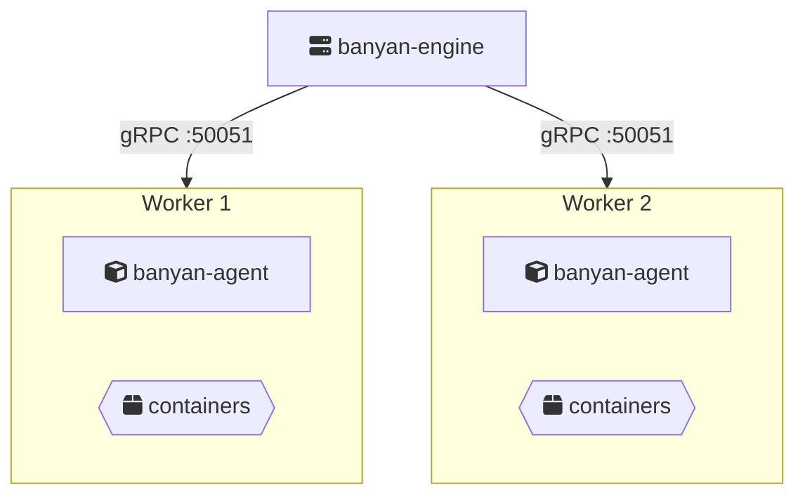

This is where Banyan earns its keep. Your `banyan.yaml` doesn't change — you add more servers, and Banyan distributes your containers across them.

## Architecture



The Engine orchestrates. Workers run containers. All communication happens over gRPC with token-based authentication.

## Prerequisites

Install the appropriate binaries on each server. See [Installation](/getting-started/installation/).

- **Engine node**: `banyan-engine`, `banyan-cli`, etcd (managed automatically by default)
- **Worker nodes**: `banyan-agent`, containerd, nerdctl
- **Deploy machine**: `banyan-cli` (can be the engine node or any other machine)

## 1. Start the Engine (~2 minutes)

On your Engine server (e.g., `192.168.1.10`):

```bash
sudo banyan-engine init
sudo banyan-engine start
```

The init wizard asks for:
- **Cluster password** — used to authenticate agents and CLI clients. Stored as a bcrypt hash (never in plain text).
- **Etcd setup** — choose **Managed** (recommended) or **External** if you have your own etcd cluster.

The Engine starts a gRPC server on port 50051 by default.

Configure the CLI to connect to the engine (run this on your deploy machine):

```bash
sudo banyan-cli init
# Enter: engine host, gRPC port, and cluster password
# The CLI exchanges the password for an auth token — the password is never saved
```

Verify the connection:

```bash
banyan-cli status
```

```
Banyan Cluster - Status
========================================
Engine: RUNNING
Connection: 192.168.1.10:50051

Agents: 0

Deployments: 0

========================================
```

## 2. Add Workers (~1 minute per worker)

On Worker 1 (`192.168.1.11`):

```bash
sudo banyan-agent init
sudo banyan-agent start --node-name worker-1
```

The init wizard asks for:
- **Engine host** — IP or hostname of the engine server (e.g., `192.168.1.10`).
- **Engine gRPC port** — default `50051`.
- **Node name** — unique name for this worker (default: hostname).
- **Cluster password** — must match the engine password.

The wizard connects to the engine and exchanges the password for an auth token. Only the token is stored locally.

On Worker 2 (`192.168.1.12`):

```bash
sudo banyan-agent init
sudo banyan-agent start --node-name worker-2
```

Each Agent connects to the Engine via gRPC, registers, and starts a heartbeat.

## 3. Verify the cluster (~30 seconds)

```bash
banyan-cli status
```

```
Banyan Cluster - Status
========================================
Engine: RUNNING
Connection: 192.168.1.10:50051

Agents: 2
  - worker-1 (status: ready, last seen: 2s ago)
  - worker-2 (status: ready, last seen: 3s ago)

Deployments: 0

========================================
```

## 4. Deploy

The same manifest from the [Quickstart](/getting-started/quickstart/) works here without changes. Banyan distributes replicas across workers automatically.

```yaml
name: my-app

services:
  web:
    build: ./web
    ports:
      - "80:80"
    depends_on:
      - api

  api:
    build: ./api
    deploy:
      replicas: 3
    ports:
      - "8080:8080"
    environment:
      - DB_HOST=my-app-db-0
      - DB_PORT=5432
    depends_on:
      - db

  db:
    image: postgres:15-alpine
    ports:
      - "5432:5432"
    environment:
      - POSTGRES_USER=banyan
      - POSTGRES_PASSWORD=secret
      - POSTGRES_DB=app
```

```bash
banyan-cli up -f banyan.yaml
```

Banyan distributes 5 containers across 2 workers using round-robin:

| Worker 1 | Worker 2 |
|----------|----------|
| my-app-web-0 | my-app-api-0 |
| my-app-api-1 | my-app-api-2 |
| my-app-db-0 | |

**The manifest didn't change.** You went from one server to two — same YAML, more capacity.

## 5. Check containers on workers

From the CLI:

```bash
banyan-cli status
```

Or SSH into a worker and list running containers directly:

```bash
sudo nerdctl ps
```

## Deploying from a remote machine

You don't need to run `up` from the Engine node. Any machine with `banyan-cli` can deploy as long as it can reach the Engine's gRPC port:

```bash
# Configure once (the engine must be running)
sudo banyan-cli init
# Enter the engine host, port, and password — receives an auth token

# Deploy from anywhere
banyan-cli up -f banyan.yaml
```

## Adding more workers

1. Install `banyan-agent`, containerd, and nerdctl on the new server.
2. Run `sudo banyan-agent init` (enter engine host, port, node name, and password — the engine must be running).
3. Run `sudo banyan-agent start`.

The new worker appears in `banyan-cli status` within seconds. Future deployments include it automatically.

That's the point — **scaling is adding a server, not editing a manifest.**

## Firewall requirements

| Port | Protocol | Direction | Purpose |
|------|----------|-----------|---------|
| 50051 | TCP | Agents/CLI → Engine | gRPC (all control plane communication) |
| 50052 | TCP | Engine → Agents | gRPC (log streaming) |
| 5000 | TCP | Agents → Engine | OCI registry (image distribution) |

Workers don't need to communicate with each other directly.
