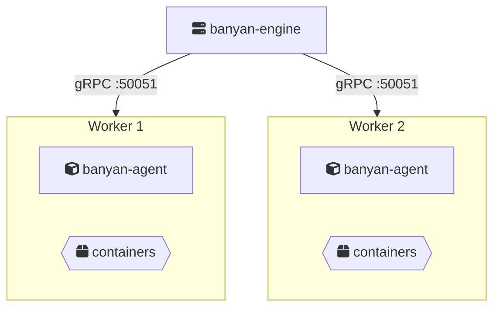

This is where Banyan earns its keep. Your `banyan.yaml` doesn't change — you add more servers, and Banyan distributes your containers across them.

## Architecture



The Engine orchestrates. Workers run containers. All communication happens over gRPC with public key authentication.

## Prerequisites

Install the appropriate binaries on each server. See [Installation](/getting-started/installation/).

- **Engine node**: `banyan-engine`, `banyan-cli`, etcd (managed automatically by default)
- **Worker nodes**: `banyan-agent`, containerd, nerdctl, wireguard-tools
- **Deploy machine**: `banyan-cli` (can be the engine node or any other machine)

## 1. Start the Engine

On your Engine server (e.g., `192.168.1.10`):

```bash
sudo banyan-engine init
sudo systemctl enable --now banyan-engine
```

During init, Banyan generates a WireGuard keypair for the engine and creates the whitelisted keys directory at `/etc/banyan/whitelisted-keys/`. The wizard also asks for:
- **Etcd setup** — choose **Managed** (recommended) or **External** if you have your own etcd cluster.

The engine's public key is displayed during init. **Copy it** — agents and CLI clients need it to set up encrypted control tunnels.

The Engine starts a gRPC server on port 50051 by default. Verify from another machine:

```bash
sudo banyan-cli init
# The wizard asks for: engine host and gRPC port
# It generates a WireGuard keypair and displays the public key

# Copy the CLI's public key to the engine
echo '<cli-public-key>' > /etc/banyan/whitelisted-keys/deploy-machine.pub
```

Verify the connection:

```bash
banyan-cli engine
```

```
Engine
==================================================
  Status:    running
  Uptime:    2m
  CPU:       1.5% (4 cores)
  Memory:    0.2GB / 4.0GB
  Disk:      8.0GB / 50.0GB

Cluster Summary
--------------------------------------------------
  Agents:       0/0 connected
  Deployments:  0/0 running
  Containers:   0/0 healthy
  Tasks:        0 completed, 0 failed
```

## 2. Add Workers

On Worker 1 (`192.168.1.11`):

```bash
sudo banyan-agent init
sudo systemctl enable --now banyan-agent
```

The init wizard asks for:
- **Engine host** — IP or hostname of the engine server (e.g., `192.168.1.10`).
- **Engine gRPC port** — default `50051`.
- **Node name** — unique name for this worker (default: hostname).
- **Engine WireGuard public key** — the engine's public key from `banyan-engine init` (optional, enables encrypted control tunnel).

During init, Banyan generates a WireGuard keypair and displays the agent's public key. Copy this key to the engine:

```bash
# On the engine machine
echo '<worker-1-public-key>' > /etc/banyan/whitelisted-keys/worker-1.pub
```

On Worker 2 (`192.168.1.12`):

```bash
sudo banyan-agent init
sudo systemctl enable --now banyan-agent
```

Each Agent connects to the Engine via gRPC, registers, and starts a heartbeat.

## 3. Verify the cluster

```bash
banyan-cli agent
```

```
NAME                 STATUS       CONTAINERS      CPU      MEM TAGS
---------------------------------------------------------------------------
worker-1             connected             0     1.2%     5.0%
worker-2             connected             0     0.8%     4.5%
```

## 4. Deploy

The same manifest from the [Quickstart](/getting-started/quickstart/) works here without changes. Banyan distributes replicas across workers automatically.

```yaml
name: my-app

services:
  web:
    build: ./web
    ports:
      - "80:80"
    depends_on:
      - api

  api:
    build: ./api
    deploy:
      replicas: 3
    ports:
      - "8080:8080"
    environment:
      - DB_HOST=db.my-app.internal
      - DB_PORT=5432
    depends_on:
      - db

  db:
    image: postgres:15-alpine
    ports:
      - "5432:5432"
    environment:
      - POSTGRES_USER=banyan
      - POSTGRES_PASSWORD=secret
      - POSTGRES_DB=app
```

```bash
banyan-cli up -f banyan.yaml
```

Banyan distributes 5 containers across 2 workers using round-robin:

| Worker 1 | Worker 2 |
|----------|----------|
| my-app-web-0 | my-app-api-0 |
| my-app-api-1 | my-app-api-2 |
| my-app-db-0 | |

**The manifest didn't change.** You went from one server to two — same YAML, more capacity.

## 5. Check containers on workers

From the CLI:

```bash
banyan-cli container
```

Or SSH into a worker and list running containers directly:

```bash
sudo nerdctl ps
```

## Deploying from a remote machine

You don't need to run `up` from the Engine node. Any machine with `banyan-cli` can deploy as long as it can reach the Engine's gRPC port:

```bash
# First configure the CLI (run once)
sudo banyan-cli init
# Enter the engine host and port — generates a keypair and displays the public key

# Copy the CLI's public key to the engine
echo '<cli-public-key>' > /etc/banyan/whitelisted-keys/deploy-machine.pub

# Deploy from anywhere
banyan-cli up -f banyan.yaml
```

After a machine reboot, run `sudo banyan-cli login` to re-establish the WireGuard tunnel. No prompts — it reads the saved config.

## Adding more workers

1. Install `banyan-agent`, containerd, nerdctl, and wireguard-tools on the new server.
2. Run `sudo banyan-agent init` (enter engine host, port, and node name).
3. Copy the agent's public key to the engine: `echo '<pubkey>' > /etc/banyan/whitelisted-keys/<name>.pub`
4. Run `sudo systemctl enable --now banyan-agent`

The new worker appears in `banyan-cli agent` within seconds. Future deployments include it automatically.

That's the point — **scaling is adding a server, not editing a manifest.**

## Firewall requirements

| Port | Protocol | Direction | Purpose |
|------|----------|-----------|---------|
| 50051 | TCP | Agents/CLI → Engine | gRPC (all control plane communication) |
| 50052 | TCP | Engine → Agents | gRPC (log streaming) |
| 5000 | TCP | Agents → Engine | OCI registry (image distribution) |
| 51820 | UDP | Agent ↔ Agent | WireGuard overlay (encrypted container traffic) |
| 51821 | UDP | Agents/CLI → Engine | WireGuard control tunnel (encrypted control plane) |
| 4789 | UDP | Agent ↔ Agent | VXLAN overlay (fallback if WireGuard unavailable) |

Workers communicate with each other over the overlay network (WireGuard or VXLAN) for cross-host container traffic. When the control tunnel is active, gRPC traffic (ports 50051/50052) flows inside the WireGuard tunnel and does not need to be exposed directly.
