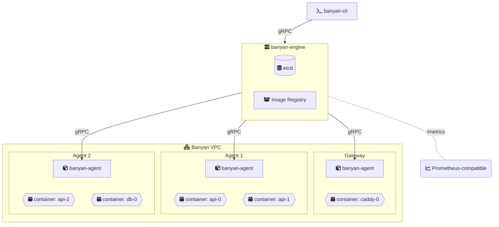

import { Card, CardGrid, Aside } from "@astrojs/starlight/components";

<div class="not-content" style="display: flex; align-items: stretch; justify-content: center; gap: 1.5rem; margin: 1rem auto 2.75rem; flex-wrap: wrap;">
  <div style="display: flex; flex-direction: column; align-items: center; gap: 0.75rem; padding: 1.25rem 2rem; background: linear-gradient(160deg, #f5f0e8, #e8ddd0); border: 1px solid #d4c9bb; border-radius: 12px; box-shadow: 0 4px 16px rgba(0, 0, 0, 0.08);">
    <span style="font-size: 1rem; text-transform: uppercase; letter-spacing: 0.1em; color: #7a6e60;">Secured by</span>
    
  </div>
  <div style="display: flex; flex-direction: column; align-items: center; gap: 0.75rem; padding: 1.25rem 2rem; background: linear-gradient(160deg, #f5f0e8, #e8ddd0); border: 1px solid #d4c9bb; border-radius: 12px; box-shadow: 0 4px 16px rgba(0, 0, 0, 0.08);">
    <span style="font-size: 1rem; text-transform: uppercase; letter-spacing: 0.1em; color: #7a6e60;">Built with</span>
    <div style="display: flex; flex-direction: column; align-items: center; gap: 1rem; margin: auto 0;">
      <div style="display: flex; align-items: center; gap: 1.5rem;">
        
        
      </div>
      <div style="display: flex; align-items: center; gap: 1.5rem;">
        
        
      </div>
    </div>
  </div>
</div>

<Aside type="caution" title="Under experiment">
  Banyan is not yet production-ready. We encourage you to experiment, break things, and [share feedback](https://github.com/fertile-org/banyan/issues).
</Aside>

<div class="not-content" style="margin: 2rem 0; text-align: center;">
  <video autoplay loop muted playsinline style="max-width: 100%; border-radius: 8px; border: 1px solid var(--sl-color-gray-5); box-shadow: 0 4px 24px rgba(0, 0, 0, 0.12);">
    <source src="/dashboard/demo-dashboard.mp4" type="video/mp4" />
  </video>
  <p style="margin-top: 0.75rem; font-size: 0.9rem; color: var(--sl-color-gray-3);"><code>banyan-cli dashboard</code> — monitor your entire cluster from the terminal</p>
</div>

## From one server to many

You know Docker Compose. You write a `docker-compose.yml`, run `docker compose up`, and it works — on one machine.

Then you need more. More servers, more replicas, more availability. The usual next step involves weeks of learning, dozens of new concepts, and infrastructure that's heavier than your application.

**Banyan takes a different approach.** Same YAML syntax you already write, distributed across your servers. No new language to learn. No templating. No 50-page getting started guide.

## One manifest, production-ready

```yaml
name: my-app

services:
  caddy:
    image: caddy:latest
    command: caddy reverse-proxy --from example.com --to api:8080
    deploy:
      placement:
        node: gateway-*       # ← pin to your public-facing servers
    ports:
      - "80:80"
      - "443:443"

  api:
    build: ./api
    deploy:
      replicas: 3             # ← scale what you need
      autoscale:
        min: 2
        max: 10
        target_cpu: 70        # ← or let Banyan scale for you
    ports:
      - "8080:8080"
    environment:
      - DB_HOST=db

  db:
    image: postgres:15-alpine
```

Same `services`, `build`, `ports`, `environment` you already know from Docker Compose. Add `deploy.replicas` to scale, `deploy.placement.node` to pin services to specific servers. One command to deploy: `banyan-cli up -f banyan.yaml`.

<CardGrid>
  <Card title="The YAML you already know" icon="document">
    `services`, `build`, `image`, `ports`, `environment`, `depends_on` — same fields, same structure. If you've written a docker-compose.yml, you can write a banyan.yaml.
  </Card>
  <Card title="Three binaries, nothing else" icon="seti:go">
    `banyan-engine`, `banyan-agent`, `banyan-cli`. No package managers, no plugins, no Helm charts, no YAML templating. Download, run, deploy.
  </Card>
  <Card title="Built-in image registry" icon="seti:docker">
    Use `build:` in your manifest and Banyan builds, stores, and distributes images across your cluster. No Docker Hub account needed. No private registry to configure.
  </Card>
  <Card title="Containers talk across servers" icon="seti:license">
    Services on different machines communicate as if they were on the same network. All traffic is encrypted with WireGuard. Banyan sets up the overlay network and DNS automatically.
  </Card>
  <Card title="Live terminal dashboard" icon="seti:cake_php">
    `banyan-cli dashboard` opens a real-time TUI — engine health, agent resources, deployments, container status, and cluster events, all updating live. Navigate views with keyboard shortcuts, drill into details, and use the built-in command palette. No Grafana setup, no browser — monitoring is one command away.
  </Card>
  <Card title="Auto-scaling built in" icon="approve-check">
    Define `target_cpu` in your manifest and Banyan scales replicas automatically. Scale up under load, scale down when idle. Graceful drain prevents dropped requests. Or scale manually with `banyan-cli scale my-app api=5`.
  </Card>
  <Card title="Encrypted secrets" icon="approve-check">
    `banyan-cli secret create DB_PASSWORD` — encrypted at rest, injected into containers as env vars. No plaintext in manifests or source control. No external Vault to set up.
  </Card>
  <Card title="High availability" icon="approve-check">
    Run multiple engines for zero-downtime control plane. All engines are active — no leader election, no manual failover. Start with one engine, add more when you need them.
  </Card>
  <Card title="Open source, self-hosted" icon="openCollective">
    Apache 2.0. Inspect the code, modify it, run it on your own servers. No vendor lock-in, no usage-based pricing.
  </Card>
</CardGrid>

## Who is Banyan for?

**Teams who've outgrown a single server but don't need — or don't want — Kubernetes.**

- A team of 5 who needs their API running on 3 servers
- A team of 50 who wants a lighter option for staging and internal tools
- Anyone who wants to write a YAML file and ship — not operate a platform

Banyan handles the orchestration so you can focus on the software you're building.

## Get a running cluster

| Platform | Architecture | Status |
|----------|-------------|--------|
| **Linux** (Ubuntu, Debian, Pop!_OS, Mint, RHEL, Fedora, Rocky) | x86_64, ARM64 | Supported |
| **macOS** | | Coming soon |
| **Windows** | | Not planned |

One-time setup on each machine:

```bash
# Control plane
sudo banyan-engine init
sudo systemctl enable --now banyan-engine

# Each agent
sudo banyan-agent init
sudo systemctl enable --now banyan-agent

# Your deploy machine (no sudo after init)
sudo banyan-cli init
```

Then deploy — every time, one command:

```bash
banyan-cli up -f banyan.yaml
```

Three focused binaries — engine, agent, and CLI. No package managers. No plugins.

## Architecture



The **CLI** sends your manifest to the **Engine**, which stores state in etcd and schedules containers across **Agents**. Each Agent runs containerd and pulls images from the Engine's built-in registry. All communication is encrypted with WireGuard and authenticated via public key whitelist. For high availability, run [multiple engines](/guides/high-availability/) — they coordinate automatically.
